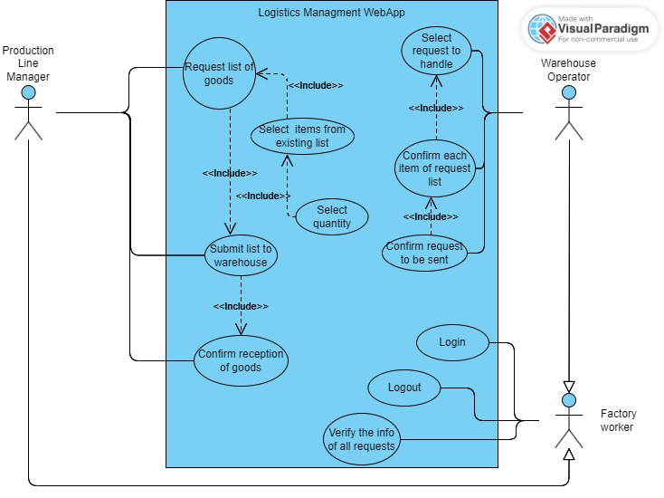

# LogisticsManagementApp


<!-- TABLE OF CONTENTS -->
<details>
  <summary>Table of Contents</summary>
  <ol>
    <li>
      <a href="#about-the-project">About The Project</a>
    </li>
    <li>
      <a href="#installation-and-running">Installation and running</a>
      <ul>
        <li><a href="#requirements">Requirements</a></li>
        <li><a href="#project-structure">Project Struture</a></li>
        <li><a href="#installation">Installation</a></li>
      </ul>
    </li>
    <li><a href="#usage">Usage</a></li>
    <li><a href="#roadmap">Roadmap</a></li>
    <li><a href="#contributing">Contributing</a></li>
    <li><a href="#license">License</a></li>
    <li><a href="#contact">Contact</a></li>
    <li><a href="#acknowledgments">Acknowledgments</a></li>
  </ol>
</details>


<!-- ABOUT THE PROJECT -->
## About The Project

The main purpose of the LogisticsManagementApp is to manage the supply and demand of goods in a factory context using an autonomous guided vehicle (AGV).

Is assumes that the factory has a Warehouse, where the goods or materials are stored and a Production Line, where the goods are needed to manufacture materials, systems or other components.  

The user, depending on wether is a Production Line worker or a Warehouse worker, can make or handle a request of goods. Requests have a sequential flow:
* Requested: a Production Line worker requested a list of goods;
* On collection: a Warehouse worker is collecting the goods for that request;
* Sent: a Warehouse worker sent the request to the production line; 
* Recieved: a Production Line worker confirmed the reception of the requested goods. 


<!-- Instalation and usage -->
## Installation and Running

This section presents what knowledge you need and steps to install and run the app.

<!-- Requirements -->
### Requirements

To run the project on your local environment, you need to have the following list of frameworks and lybraries:
* Angular CLI v17.0.10
* Typescript v5.2.2
* Node v18.15.0
* MongoDb v7.0.2

<!-- Project struture -->
### Project structure


.

├── miscelaneous                # Folder for diagrams and others

├── server                      # Folder Node api and server

│   ├── Goods                   # Controller for goods db collection 

│   ├── Requests                # Controller for requests db collection

│   |── Users                   # Controller for users and authentication collection

│   |── utils                   # Folder for variables definitions

|   |── generate-data.js        # file to generate data onto db

|   └── app.js                  # server file

└── src                         # Folder containing the angular project

    └── app                     # Folder containing the angular components

        ├── auth                # Folder for components and services related to authentication and login 

        ├── main-page           # Folder for components and services related to the main purpose of the app 

        |   ├── dashboard       # Folder for components and services related to the dashboard and display of all the data 

        |   ├── handle-requests # Folder for components and services related to make a request or confirm it -> dedicated to Production Line workers 

        |   ├── header          # Folder for components for the app nav bar 

        |   └── request-goods   # Folder for components and services related to handle a request -> dedicated to Warehouse workers

        ├── models              # Folder containing the interfaces that define the models of the requests, users and goods 
        
        └── services            # Folder that contains goods and requests services


<!-- Installation -->
### Installation

After you have all the requirements installed, clone the repository onto a folder of your choosing
 ```sh
  git clone https://github.com/rafarlho/LogisticsManagementApp.git 
  ```

Navigate to the server directory to install the dependencies for teh server:
```sh
  cd server
```
```sh
  npm install
```

If you dont have data generated, you can generate it on the server directory using the command:
```sh
  node generate.js 
```

Then you can start the server by running:
```sh
  node app.js 
```
The message "Running the api..." should appear if successful. 

Then, on another terminal, navigate to the root folder to install the dependencies for the angular app:
```sh
  npm install 
```
Run the app
```sh
  ng serve 
```

And navigate to "http://localhost:4200/" on your browser to use the app.
