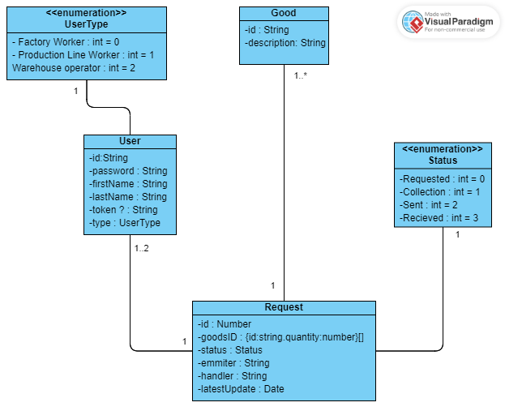

# LogisticsManagementApp


<!-- TABLE OF CONTENTS -->
<details>
  <summary>Table of Contents</summary>
  <ol>
    <li>
      <a href="#about-the-project">About The Project</a>
      <ul>
        <li><a href="#built-with">Built with</a></li>        
        <li><a href="#users">Users</a></li>
        <li><a href="#goods">Goods</a></li>
        <li><a href="#requests">Requests</a></li>
        <li><a href="#class-diagram">Class diagram</a></li>
      </ul>
    </li>
    <li>
      <a href="#installation-and-running">Installation and running</a>
      <ul>
        <li><a href="#requirements">Requirements</a></li>
        <li><a href="#project-structure">Project Struture</a></li>
        <li><a href="#installation">Installation</a></li>
        <li><a href="#usage">Usage</a></li>         
        <li><a href="#possible-improvements">Possible improvements</a></li> 
      </ul>
    </li>
  </ol>
</details>


<!-- ABOUT THE PROJECT -->
## About The Project

The main purpose of the LogisticsManagementApp is to manage the supply and demand of goods in a factory context using an autonomous guided vehicle (AGV).

Is assumes that the factory has a Warehouse, where the goods or materials are stored and a Production Line, where the goods are needed to manufacture materials, systems or other components.  

The user, depending on whether is a Production Line worker or a Warehouse operator, can make or handle a request of goods. Requests have a sequential flow:
* Requested: a Production Line worker requested a list of goods;
* On collection: a Warehouse operator is collecting the goods for that request;
* Sent: a Warehouse operator sent the request to the production line; 
* Received: a Production Line worker confirmed the reception of the requested goods. 


<!-- Built with -->
### Built with

The application was built using Angular as front-end framework and the following libraries:
* Angular Material "https://material.angular.io/"
* ChartsJs "https://www.chartjs.org/docs/latest/"
* Ng2-Charts "https://valor-software.com/ng2-charts/"
* RxJs "https://rxjs.dev/"

The server and API was built on NodeJs and the following libraries:
* mongoose 'https://mongoosejs.com/'
* express  'https://expressjs.com/'
* cors 'https://www.npmjs.com/package/cors'
* JsonWebToken 'https://jwt.io/'

<!-- Users -->
### Users

The application contains three types of users:
* Factory worker: this type can only access the dashboard to see information relative to the requests and goods, it can't make or handle requests.
* Production Line worker: this type can make requests and confirm the reception of them, but cannot collect them.
* Warehouse operator: this type can only collect requests and send them to the production line.

Below is the use case diagram.


<!-- Goods -->
### Goods

The goods represent any material that is required a required in the production line and is stored in the warehouse. It is identified by and ID and description

<!-- Requests -->
### Requests

The requests represent an order emitted or handle by a worker with a list of goods and a timestamp of the last update on that request.


<!-- Requests -->
### Class diagram

Below is the class diagram for all the models and how they interact with each other.



<!-- Instalation and usage -->
## Installation and Running

This section presents what knowledge you need and steps to install and run the app.

<!-- Requirements -->
### Requirements

To run the project on your local environment, you need to have the following list of frameworks and libraries:
* Angular CLI v17.0.10
* Typescript v5.2.2
* Node v18.15.0
* MongoDb v7.0.2

<!-- Project struture -->
### Project structure

```
. 
├── miscelaneous                # Folder for diagrams and others
├── server                      # Folder Node api and server
│   ├── Goods                   # Controller for goods db collection 
│   ├── Requests                # Controller for requests db collection
│   |── Users                   # Controller for users and authentication collection
│   |── utils                   # Folder for variables definitions
|   |── generate-data.js        # file to generate data onto db
|   └── app.js                  # server file
└── src                         # Folder containing the angular project
    └── app                     # Folder containing the angular components
        ├── auth                # Folder for components and services related to authentication and login 
        ├── main-page           # Folder for components and services related to the main purpose of the app 
        |   ├── dashboard       # Folder for components and services related to the dashboard and display of all the data 
        |   ├── handle-requests # Folder for components and services related to make a request or confirm it -> dedicated to Production Line workers 
        |   ├── header          # Folder for components for the app nav bar 
        |   └── request-goods   # Folder for components and services related to handle a request -> dedicated to Warehouse workers
        ├── models              # Folder containing the interfaces that define the models of the requests, users and goods 
        └── services            # Folder that contains goods and requests services
 ```
<!-- Installation -->
### Installation

After you have all the requirements installed, clone the repository onto a folder of your choosing:
 ```sh
  git clone https://github.com/rafarlho/LogisticsManagementApp.git 
  ```

Navigate to the server directory to install the dependencies for the server:
```sh
  cd server
```
```sh
  npm install
```

If you don't have data generated, you can generate it on the server directory using the command:
```sh
  node generate.js 
```

Then you can start the server by running:
```sh
  node app.js 
```
The message "Running the api..." should appear if successful. 

Then, on another terminal, navigate to the root folder to install the dependencies for the angular app:
```sh
  npm install 
```
Run the app:
```sh
  ng serve 
```

And navigate to "http://localhost:4200/" on your browser to use the app.


<!-- Usage -->
### Usage

Once you're able to access the app, as mentioned above, you can select between three types of users.
To simplify, here are users created for testing purpose:

Factory worker: 
* ID: lara
* password: 123qwe

Production Line Worker: 
* ID: rafa
* password: 123qwe

Warehouse operator: 
* ID: joao
* password: 123qwe

Feel free to explore the app and managing your factory!


<!-- Possible improvements -->
### Possible improvements

Some of the possible improvements that the app can get are the following:
* Improve authentication: the authentication interceptor is not working correctly, still figuring out why not;
* Docker compose: implement a Dockerfile for easy mounting and local deployment, but needed to rebuild the API and Server:
* Edit request while status is 'requested': a production line worker could edit the request while it is still not collected;
* Implement NgRx;
* Improve colors and front-end display;
* Improve resizing display, not fit for small screens for now.